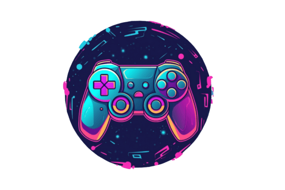

 

<h1 align="center">games</h1> 
🤖 A collection of simple and different games written on C#, C++, Python and JavaScript.

---

- [**`2048`**](./2048/) - A single-player puzzle game on `C#`. The main goal of the game is to slide tiles with numbers on a grid to add them to create a tile with the number 2048, but you can keep playing after you reach that number.

---

- [**`BarleyBreak`**](./BarleyBreak/) - A popular chasing game on `C#`, mentioned often in literary sources of the 16th to 18th centuries, played either by children or young people of both sexes. The goal of the game is to collect chips in a field with numbers in order, using as few moves as possible and in a shorter time. 

---

- [**`BushedBricks`**](./BushedBricks/) - Simple and fun game on `JavaScript`. Combine tiles of same color. Once tile has reached x4 or above, it can be placed on appropriate color line. You'll get game points for that. You need to hold 400 steps or earn 5,000 points to win. Use navigation keys (← ↑↓→) for desktop or swipe for tablet/mobile.

---

- [**`cppAsteroids`**](./cppAsteroids/) - Asteroids game on OpenGL/C++. 
  - glut download: `https://www.opengl.org/resources/libraries/glut/`.

---

- [**`cppBreakout`**](./cppBreakout/) - Breakout game on OpenGL/C++. 
  - glut download: `https://www.opengl.org/resources/libraries/glut/`.

---

- [**`cppCheckers`**](./cppCheckers/) - Checkers game on OpenGL/C++. 
  - glut download: `https://www.opengl.org/resources/libraries/glut/`.

---

- [**`cppMinesweeper`**](./cppMinesweeper/) - Minesweeper game on OpenGL/C++. 
  - glut download: `https://www.opengl.org/resources/libraries/glut/`.

---

- [**`cppSnake`**](./cppSnake/) - Snake game on OpenGL/C++. 
  - glut download: `https://www.opengl.org/resources/libraries/glut/`.

---

- [**`cppTetris`**](./cppTetris/) - Tetris game on OpenGL/C++. 
  - glut download: `https://www.opengl.org/resources/libraries/glut/`.

---

- [**`Hangman`**](./Hangman/) - The hangman, also known as "hanged" is a classic game on `C#` in which you will have to guess a word by choosing the letters that you think may be included in it. The hangman game will give you the option to choose vowels and consonants to try to guess which word is hidden.

---

- [**`iGenius`**](./iGenius/) - Implementing of simple graphics game **Colliding Balls** on `Python`.

---

- [**`JumpingMen`**](./JumpingMen/) - Implementing of simple graphics game with jump man like Super Mario on `C#`.

---

- [**`PingPong`**](./PingPong/) - Classic Pong game on `C#` for one player. This is a simple version of the game, but very customizable and fun.

---

- [**`PingPongTwo`**](./PingPongTwo/) - Classic Pong game on `C#` for two players. This is a simple version of the game, but very customizable and fun.

---

- [**`Snake`**](./Snake/) - Basic snake game implemented on `C#`.

---

- [**`TicTacToe`**](./TicTacToe/) - Tic-Tac-Toe is a very simple two player game on `C#`. So only two players can play at a time. This game is also known as Noughts and Crosses or Xs and Os game. One player plays with X and the other player plays with O. In this game we have a board consisting of a 3X3 grid. The number of grids may be increased.

---

> [!NOTE]
> 
> [`A powerful archive`](https://github.com/leereilly/games) — a list of games, add-ons, maps, etc. hosted on GitHub. Any genre. Any platform. Any engine.